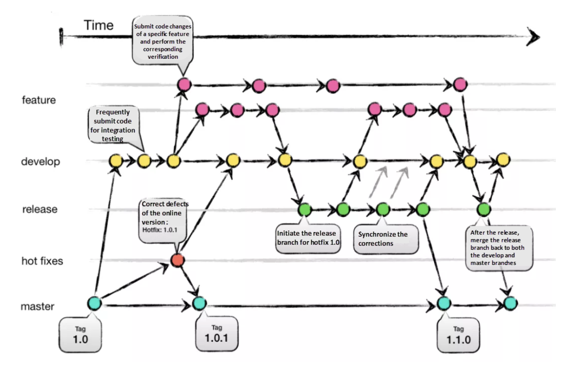
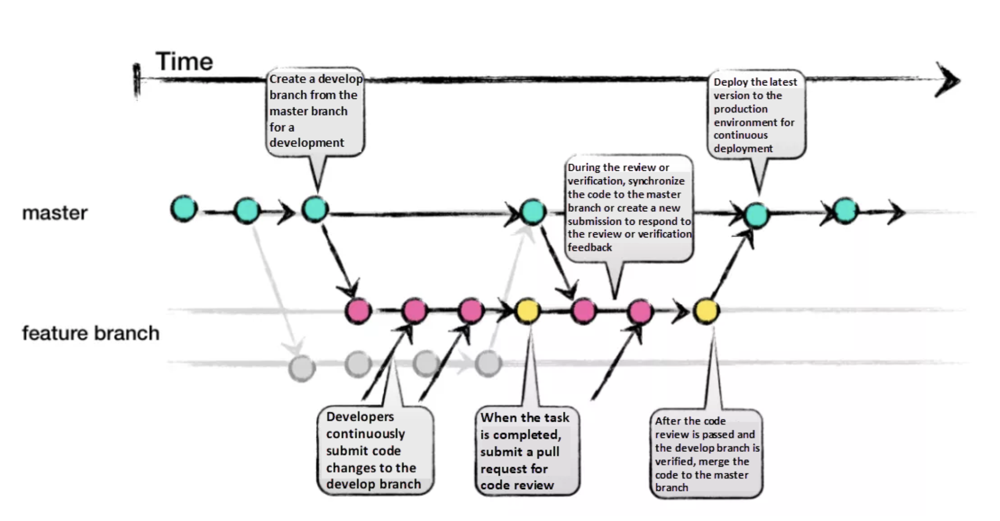

# Git 기초 개념

Git은 코드 변경 이력을 관리하는 도구.

Git ≠ Github. Git은 내 컴퓨터 내부에서 버전 관리(Version Control System)만을 담당

Github는 그걸 인터넷에 올리는 클라우드

## 0. 기초 설정

**`git config`**

초기 지정용 -> 처음에 유저네임/이메일 적용 후에는 건드릴 이유 없음

github의 유저네임과 이메일과 똑같이 적용하는게 맞다

```bash
git config --global.user.name  # 유저네임 지정
git config --global.user.emali # 이메일 지정
```


## 1. 저장소(Repository)

- 저장소는 파일과 폴더를 버전(변경 이력) 단위로 저장하는 공간이다.
- `원격 저장소(Remote Repository)`는 서버에서 관리되는 저장소이다.
- `로컬 저장소(Local Repository)`는 개인 PC에서 관리되는 저장소이다.


**`git init`**

Git 저장소 초기화.

저장소가 아닌 일반 폴더에서 최초 1회만 실행하는 명령어.

실행하면 현재 위치한 폴더가 Git 저장소로 초기화.

폴더 안에 .git 폴더를 만들어줌 → 지워버리면 저장소가 아니게 됨

```bash
git init
```
**`git remote add origin`**

```bash
git remote add origin <URL> #연결해줄 github의 remote repository의 주소를 지정해줌
```


### `.gitignore`

Git에서 관리하지 않을 파일 목록을 정의하며, 저장소 최상위 디렉터리에 위치해야 한다.
    
```
### Java ###
# Compiled class file
*.class

# Package Files #
*.jar
*.war
*.nar
*.ear
*.zip
*.tar.gz
*.rar

### Windows ###
# Windows thumbnail cache files
Thumbs.db

# Windows Installer files
*.cab
*.msi
*.msix
*.msm
*.msp
```
    

## 2. 커밋(Commit)

- 로컬 저장소에 파일이나 폴더의 변경 사항을 기록하는 작업을 `커밋(Commit)`이라고 한다.
- Git은 커밋을 시간 순으로 저장하며, 이전 상태부터 현재 상태까지의 변경 이력을 관리한다.


**`git commit`**

변경 사항을 Git에 저장. **커밋 메시지로 설명 추가.**

```bash
git commit -m "<메시지>"
```

이미 add된 변경사항만 commit할 수 있다.

## **`git status`**

현재 Git 상태 확인. 어떤 파일이 수정되었고, 추가할 파일은 무엇인지 확인.

```bash
git status
```


## 3. 인덱스(Index) 또는 스테이지 영역(Stage Area)

- 커밋하기 위해 선택한 파일이 임시로 저장되는 공간을 `인덱스(Index)` 또는 `스테이지 영역(Stage Area)`이라고 한다.


**`git add`**

최초 등록 포함해서 특정 파일 또는 모든 파일을 스테이지에 추가.

```bash
git add <파일명>  # 특정 파일만 지정
git add .        # 현재 폴더 전체
```

## 4. 브랜치(Branch)

- 저장소 안에서 독립적인 작업 흐름을 만들기 위한 기능을 `브랜치(Branch)`라고 한다.
- 여러 개발자가 서로 영향을 주지 않고 동시에 다양한 작업을 할 수 있도록 도와준다.
    

## 5. 체크아웃(Checkout)

- 현재 작업 중인 브랜치나 특정 커밋으로 작업 위치를 변경하는 것을 `체크아웃(Checkout)`이라고 한다.
- `HEAD`는 현재 작업 중인 브랜치 또는 커밋을 가리키는 포인터로 대부분의 경우에는 현재 브랜치의 최신 커밋을 가리킨다.
    

- 브랜치가 아닌 특정 커밋으로 이동하면 HEAD가 브랜치를 가리키지 않는데 이 상태를 `Detached HEAD(분리된 HEAD)`라고 한다.
- `Detached HEAD` 상태에서는 브랜치가 없는 상태이므로 커밋을 만들면 브랜치에 연결되지 않는다.
    


## 6. 병합(Merge)

- 특정 브랜치에서 수행한 작업을 다른 브랜치에 합치는 것을 `병합(Merge)`이라고 한다.
    

## 7. 복제(Clone)

- 원격 저장소의 전체 내용을 사용자 로컬 저장소로 복사하는 것을 `복제(Clone)`이라고 한다.

**`git clone`**

```bash
git clone <URL>
```


## 8. 푸시(Push)

- 로컬 저장소에서 커밋을 원격 저장소에 업로드하는 작업을 `푸시(Push)`라고 한다.
- 푸시전에 항상 풀을 받아서 원격지의 최신 상태와 수정 내용을 병합, 재배치 후 푸시를 해야 한다.

**`git push`**

```bash
git push origin main
```


## 9. 풀(Pull)

- 원격 저장소에서 최신 변경 내용을 가져와 로컬 저장소에 반영하는 것을 `풀(Pull)`이라고 한다.

**`git pull`**


원격 저장소의 변경 내용을 내 로컬 저장소로 가져와 병합

다른 사람이 푸시한 내용을 내가 받아올 때 사용
```bash
git pull origin <브랜치명> #해당 브랜치의 최신 내용을 가져옴
```


## Git flow

### git flow 브랜치 전략

- main : 제품으로 출시될 수 있는 브랜치
- develop : 다음 출시 버전을 개발하는 브랜치
- feature : 특정 기능을 개발하는 브랜치
- release : 이번 출시 버전을 준비하는 브랜치
- hotfix : 출시 버전(main)에서 발생한 버그를 수정 하는 브랜치



0. 신규 기능 필요
1. 기존 버전을 develop 버전으로 가져옴
2. 구현해야 하는 기능들을 feature 브랜치들로 나눠서 하나씩 작업
3. 기능 구현이 끝나면 develop과 머지 후 feature 브랜치 삭제
4. release 브랜치에서 배포 전 버그수정, QA, 테스트 등 진행 <-> 수정내용을 develop에서 수정
5. 안정적으로 완성된 버전을 main에 머지
6. 라이브 서비스 중 문제가 생기면 hotfix에서 수정


### github flow




# Branch 명령어

1. ## **`git branch`**

    브랜치 스티커를 현재 commit에 붙이는 명령어

    독립적인 작업 공간인 branch를 생성한다

    기존 코드에 영향을 주지 않고 새로운 기능을 실험/개발 시 사용

    ```bash
    git branch        # 현재 브랜치 목록을 확인
    git branch <이름> # <이름>이라는 브랜치를 현재 commit에 생성
    ```

    이 때, 현재 어떤 브랜치에 있는지는 `*`표시로 확인(이걸 `HEAD`라고 함)


1. ## `git switch`

    원하는 스티커가 붙어 있는 브랜치로 이동할 수 있다.

    다른 브랜치로 이동하거나 새 브랜치를 생성하고 이동할 수 있음

    **무조건 현재 작업중인 파일을 저장/스테이징/커밋 후에만 이동 가능함**

    ```bash
    git switch <브랜치 이름>
    git switch -c <새 브랜치 이름> # 새 브랜치 생성 후 이동
    ```
    예전에는 `git checkout`을 이용했음


1. ## `git merge`

    작업한 브랜치를 다른 브랜치(main 포함)에 병합

    이 때 알아서 어느 부분이 다른지 알려주고, 다른 부분을 선택할 수 있다.

    **현재 Head가 있는 브랜치에서 merge할 branch를 선택하는 형식**

    ```bash
    git merge <브랜치2>
    ```

    병합 후에는 브랜치를 삭제해도 됨 (`git branch -d <브랜치명>`)

1. ## `git rebase`
    ```
    git rebase <브랜치>
    ```
    현재 HEAD가 있는 커밋을 복사해서 목적지 다음 커밋으로 옮겨 놓음

    따로 개발했지만, 커밋 상으로는 순서대로 개발한 것으로 보이게 됨

    대신 기존의 브랜치는 이동하지 않기 때문에 기존 커밋에서 한번 더 rebase를 써서 브랜치를 이동시켜야 한다.

1. ## `git reset`, `git revert`
    ```bash
    git reset HEAD~1
    git revert HEAD
    ```
    둘 다 이전 버전의 커밋에 HEAD를 올리는 개념
    
    reset은 아예 시간을 과거로 돌림 -> 현재의 커밋은 아예 삭제

    revert는 원하는 버전의 커밋을 가져와서 현재 커밋 뒤에 붙임 -> 변경 내용을 남에게 push 가능
    
    로컬에서 사용할 때는 주로 reset, 리모트에서 협업할 경우 revert를 주로 사용함

1. ## `git cherry-pick`
    ```bash
    git cherry-pick <커밋1> <커밋2><...>
    ```
    현재 위치(HEAD) 아래에 일련의 커밋들을 복사해서 붙여넣기 하겠다는 의미

    ## # 상대 참조

    ```bash
    git switch main~2 # main 커밋의 부모의 부모(2단계 위)에 HEAD를 이동
    git switch main^  # main 커밋의 부모 커밋에 HEAD를 이동
    ```
    HEAD 또한 상대 참조의 기준으로 할 수 있다


# [Git Learning](https://learngitbranching.js.org/?locale=ko)
