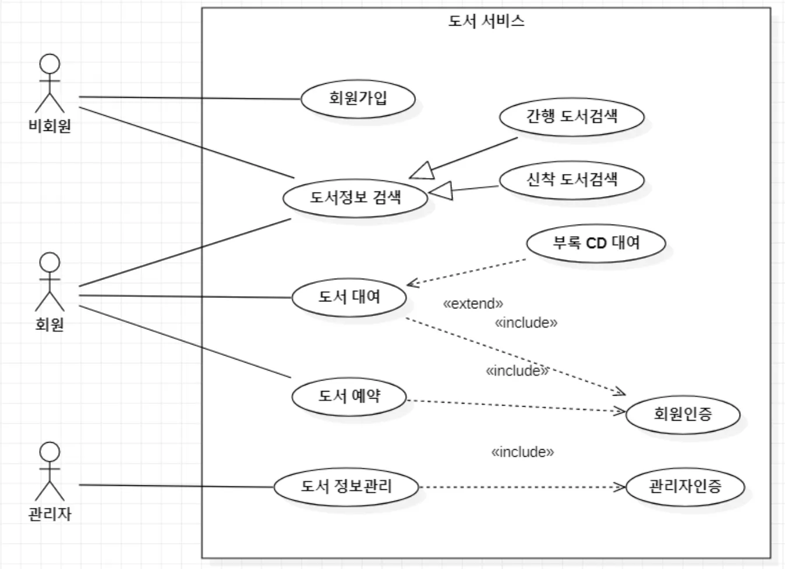
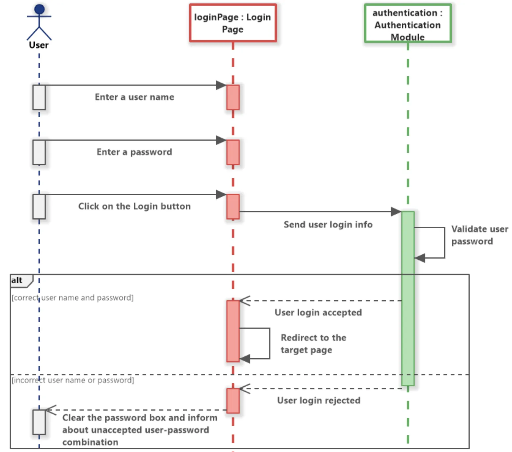
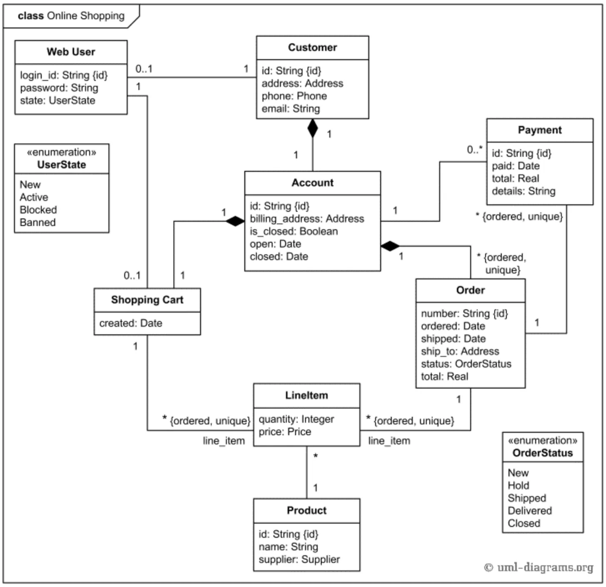
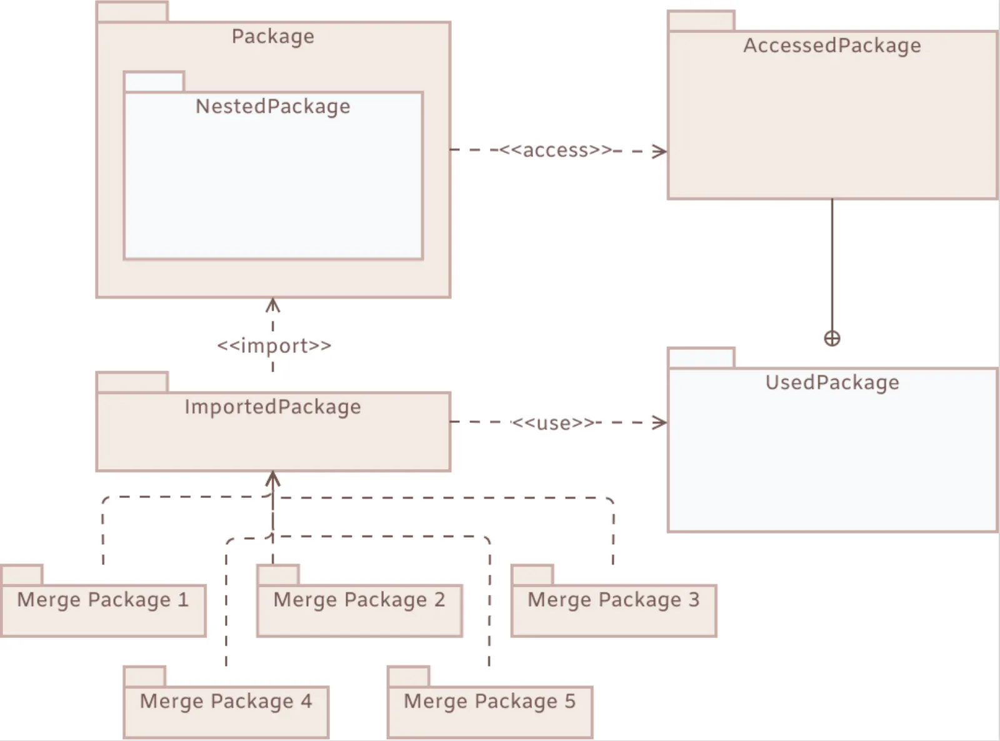
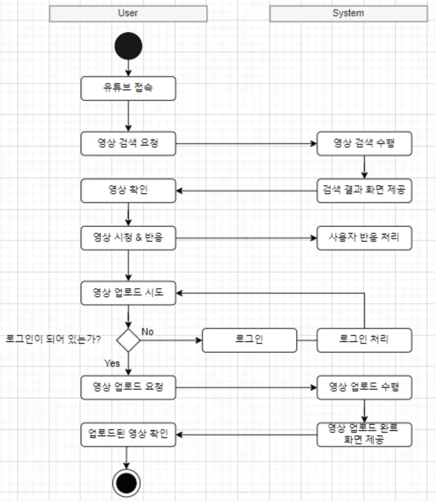
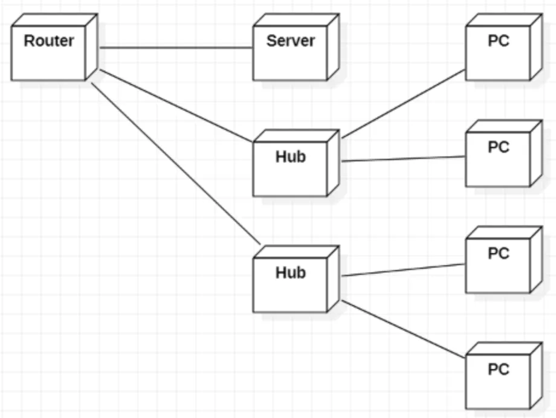

# UML(Unified Modeling Language)

## 1. UML(Unified Modeling Language)

- UML은 소프트웨어를 시각적으로 모델링 하기 위해 사용한다.
- UML은 소프트웨어를 모델링 하는 표준 그래픽 언어로 심벌과 그림을 사용하여 나타낼 수 있다.

## 2 UML의 목적

- UML의 목적은 소프트웨어 개발에 도움을 주는 것이다.
- 개발 과정에 여러 가지 다이어그램으로 설계하면 구조가 좋아지고 개발자들 간의 의사 교환이 쉬어진다.

## 3. UML 다이어그램의 종류

### 3.1. 사용 사례 다이어그램

- 액터와 사용 사례를 통해 시스템의 기능을 모델링 하는 데 사용한다.
- 개발하려는 시스템의 기능적 요구 또는 업무 프로세스의 개관을 나타낸다.
    
    

### 3.2. 시퀀스 다이어그램

- 객체 사이의 메시지 교환을 시간의 흐름에 따라 나타낸 것이다.
- 즉, 사용 사례로 표시된 업무 프로세스에 대해 시스템 안의 존재하는 객체가 어떤 식으로 개입하여 상호작용하는지를 나타낸다.
    
    

### 3.3. 클래스 다이어그램

- 객체지향 시스템의 가장 근간이 되는 다이어그램으로 시스템의 정적인 구조를 나타낸다.
- 또한 도메인(문제 영역)의 개념과 그것들 사이의 관계를 표시한다.
    
        

### 3.4. 패키지 다이어그램

- 관련된 클래스를 패키지로 그루핑하여 복잡한 시스템을 조직화하는 데 사용한다.
    
        

### 3.5. 상태 다이어그램

- 외부 자극에 대한 시스템의 동적 상태 변화를 나타낸다.
- 외부 이벤트에 대해 민감하게 상태를 변화시키는 객체를 모델링 한다.
    
        

### 3.6. 액티비티 다이어그램

- 시스템의 내부 프로세스를 단계별 작업 흐름 형태로 모델링 한다.
- 시스템의 동적 특징을 나타낸다.
    
        

### 3.7. 배치 다이어그램

- 노드, 컴포넌트, 커넥터 등 시스템의 물리적 자원 배치를 나타낸다.

    