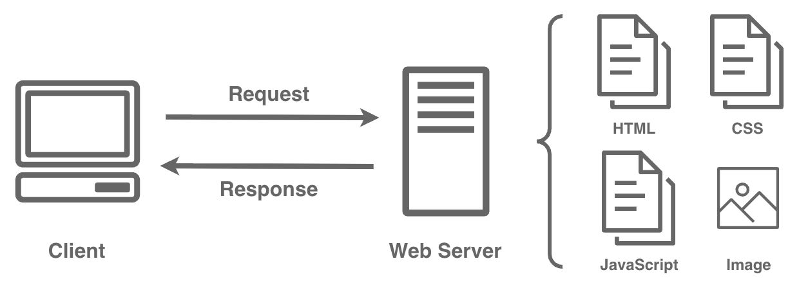
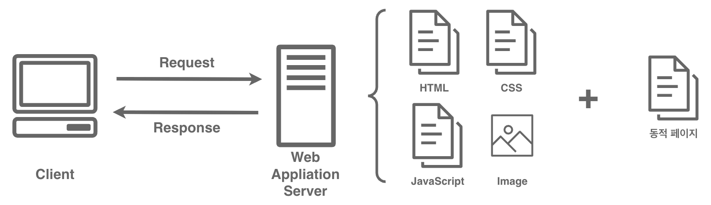
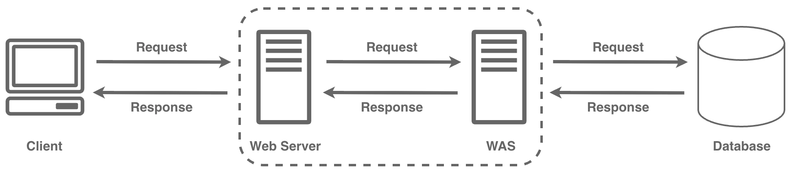

# 웹 기초

## 웹 서버(Web Server)

- 웹에서 클라이언트의 요청을 받아 HTML, CSS, JavaScript, 이미지(JPG, PNG 등) 와 같은 정적 자원을 HTTP 프로토콜을 통해 웹 브라우저에 제공하는 서버이다.

- 서버 내부에 미리 생성된 **정적인** 콘텐츠를 전달하는 역할을 주로 수행한다.

### 웹 애플리케이션 서버(Web Application Server, WAS)

- 웹에서 클라이언트의 요청을 받아 비즈니스 로직을 수행하고, 그 결과를 바탕으로 **동적인** 콘텐츠를 생성하여 웹 브라우저에 제공하는 서버이다.

- 데이터베이스 연동, 인증·인가, 트랜잭션 처리 등 애플리케이션의 핵심 로직을 담당한다.

- 기본적으로 WAS는 웹서버의 역할을 같이 수행할 수 있다.
    - WAS의 경우, 요청이 정적 컨텐츠인지, 동적 컨텐츠인지 구분해서 처리해야 해서 처리 속도가 느리다.
    - 기본적으로 웹 페이지를 웹 서버로 만들고, 동적 컨턴츠가 필요할 경우 WAS로 처리함
    - Tomcat을 이용해 WAS를 쉽게 구현할 수 있음.

### 3-Tier Architecture

- 3-Tier Architecture는 애플리케이션을 역할별로 표현(Presentation), 비즈니스 로직(Business), 데이터(Data)의 3개 계층(Tier)으로 나누어 설계하는 구조이다.

- 계층 간 역할을 명확히 구분함으로써 유지보수, 확장, 보안에 유리해 실무에서 널리 사용된다.

## URL

tomcat을 통해 서버를 열면, 다음과 같이 URL이 생성된다.

`http://localhost:8080/servlet/`

1. `http://`

    - 프로토콜 종류

2. `localhost`

    - 도메인
    - `127.0.0.1`(자기 자신), `192.168.56.1`(내 IP 주소)에 요청을 보내도 같은 곳으로 간다.
    - 웹의 어떤 사이트를 확인할 때, `naver.com`같은 도메인을 이용한다. 도메인을 이용하면 원래는 DNS(Domain Name Server)에서 도메인과 맞는 IP주소를 가져옴.
    - 만약 `C:\Windows\System32\drivers\etc\hosts`에 특정 도메인을 `127.0.0.1`로 등록하면 그 도메인은 DNS보다 localhost로 먼저 간다.

3. `:8080`
    - 포트번호
    - 한 PC에서 여러 서버가 돌아갈 수 있는데, 어떤 서버에 요청할 것인지 선언하는 부분.
    - MariaDB는 3306, tomcat은 8080 이런식으로 돌아간다. 직접 설정할 수 있음

4. `/servlet`

    - context path
    - tomcat의 여러 애플리케이션 중 어떤 context path를 사용할지 선언하는 내용

5. `/...`

    - `webapp` 폴더의 어떤 파일을 실행시킬지 선언
    - `/` 뒤에 아무것도 없다면 자동으로 `index.html` 파일을 실행하고, `index.html`이 없다면 JSP 파일을 찾아서 실행한다.

