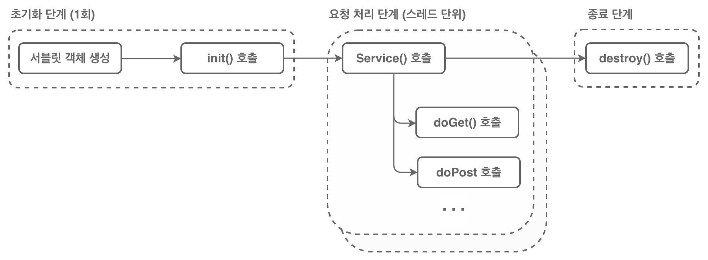

# 서블릿(Servlet)

## 애플릿(Applet)

- 웹 브라우저에서 실행되는 자바 응용프로그램으로 서버에서 클라이언트 쪽으로 실행 파일을 내려받아서 실행되는 방식이다.
    - ActiveX(C언어에서 사용되는 Applet)와 같은 것으로, 웹페이지에 특정 기능을 구현하고 싶을 때, 실행파일을 이용해 구현하는 것.
- 현재는 HTML5, CSS3, JavaScript 등의 기술들의 발전으로 애플릿을 사용하고 있지 않다.

## 서블릿(Servlet)

- Server Side Applet으로 자바 언어로 구현되는 서버 프로그램이다.

- 서블릿은 웹 브라우저로부터 요청을 받아 처리하고 결과를 다시 웹 브라우저로 전송하는 역할을 한다.

- 일반적인 자바 클래스와 다르게 `jakarta.servlet.http.HttpServlet` 클래스를 상속해야 한다.
    
    ```java
    public class 클래스명 extends HttpServlet {
      ...
    }
    ```
    - `HttpServlet` 클래스는 서블릿이 웹상에서 HTTP 프로토콜을 이용해 서비스를 처리하기 위해 반드시 상속해야 하는 클래스이다.

- Jakarta EE에만 들어가 있어 원래는 사용이 안되는데, tomcat에 이 라이브러리가 들어있어 그걸로 사용할 수 있다.

## 서블릿 메소드

### `.doGet()`

- 클라이언트에서 GET 방식(데이터 조회, 파라미터 전송 등)으로 요청이 전송될 경우 호출되는 메소드이다.
    
    ```java
    protected void doGet(HttpServletRequest request, HttpServletResponse response) {
      // GET 요청에 응답할 로직을 구현
    }
    ```
    

### `.doPost()`

- 클라이언트에서 POST 방식(서버에 데이터 생성, 수정, 삭제 등)으로 요청이 전송될 경우 호출되는 메소드이다.
    
    ```java
    protected void doPost(HttpServletRequest request, HttpServletResponse response) {
      // POST 요청에 응답할 로직을 구현
    }
    ```
    

## 요청 객체와 응답 객체

- 스프링 부트를 이용하면 서블릿 자체는 하나 자동으로 만들어서 그것만 쓴다.

- 그런데 `HttpServletRequest`, `HttpServletResponse` 두 객체가 뭘 할 수 있는지는 꼭 알아야 한다.

### `HttpServletRequest`

- 클라이언트(웹 브라우저)에서 서버에 보내는 요청 정보를 제공하는 객체이다.

- `jakarta.servlet.ServletRequest`를 상속한다.

- 주요 메소드
    
    | 메소드명 | 내용 |
    | --- | --- |
    | getParameter(String) | 클라이언트가 전송한 데이터 중, 매개변수로 전달한 이름에 해당하는 값을 문자열로 반환하는 메소드 |
    | getParameterNames() | 클라이언트가 전송한 모든 데이터의 이름을 반환하는 메소드 |
    | getParameterValues(String) | 클라이언트가 전송한 데이터 중, 동일한 이름에 해당하는 값들을 문자열 배열로 반환하는 메소드 |
    | getParameterMap() | 클라이언트가 전송한 모든 데이터를 Map<String, String[]> 형태로 반환하는 메소드 |
    | setAttribute(String, Object) | request 객체에 데이터를 이름(String)과 함께 저장하는 메소드 |
    | getAttribute(String) | request 객체에 저장된 이름(String)에 해당하는 객체를 반환하는 메소드 |
    | removeAttribute(String) | request 객체에 저장된 이름(String)에 해당하는 데이터를 제거하는 메소드 |
    | setCharacterEncoding(String) | request 객체에 포함된 데이터의 문자 인코딩 방식을 설정하는 메소드 |
    | getRequestDispatcher(String) | 요청을 다른 리소스(JSP, Servlet 등)로 전달하기 위한 RequestDispatcher 객체를 반환하는 메소드 |

### `HttpServletResponse`

- 서버가 클라이언트(웹 브라우저)로 보내는 응답 정보를 처리하는 객체이다.

- `jakarta.servlet.ServletResponse`를 상속한다.

- 주요 메소드
    
    | 메소드명 | 내용 |
    | --- | --- |
    | setContentType(String) | 응답으로 전송할 데이터의 MIME 타입과 문자 인코딩 방식을 설정하는 메소드 |
    | setCharacterEncoding(String) | 응답으로 전송할 데이터의 문자 인코딩 방식을 설정하는 메소드 |
    | getWriter() | 문자 데이터를 응답으로 전송하기 위한 PrintWriter 객체를 반환하는 메소드 |
    | getOutputStream() | 바이트 데이터를 응답으로 전송하기 위한 ServletOutputStream 객체를 반환하는 메소드 |
    | sendRedirect(String) | 클라이언트에게 지정한 URL로 다시 요청하도록 응답하는 메소드 |

    - `.getWriter()`를 많이 쓴다.

        ```java
        PrintWriter out = resp.getWriter();

        out.println("<!DOCTYPE html>");
        out.println("<html lang=\"ko\">");
        ...
        ```

## 서블릿 매핑

- 사용자의 요청을 서블릿에게 전달하기 위해서는 서블릿을 등록하고 매핑해야 한다.

- 서블릿을 등록하고 매핑할 때는 배포 서술자나 어노테이션을 이용한다.
    
    1. 배포서술자, `web.xml`
        
        ```xml
        <web-app ... >
            <!--  서블릿 등록: first  -->
            <servlet>
                <servlet-name>first</servlet-name>
                <servlet-class>com.beyond.servlet.FirstServlet</servlet-class>
            </servlet>
            <!--  서블릿 매핑: http://localhost:8080/servlet/first.do  -->
            <servlet-mapping>
                <servlet-name>first</servlet-name>
                <url-pattern>/first.do</url-pattern>
            </servlet-mapping>
        </web-app>
        ```
        - 배포 설정 파일에 직접 서블릿을 등록하고, 요청을 매핑하는 방법
        - `/first.do`처럼 요청이 들어올 때 `fisrt`을 가진 서블릿을 실행하는데, 이 때 `first` 이름에는 클래스 `com.beyond.servlet.FirstServlet`가 등록되어 실행한다.
    
    2. 어노테이션(tomcat 7버전부터 적용 가능)

        ```java
        @WebServlet(name = "second", urlPatterns = {"/second.do", "/second2.do"})
        public class SecondServlet extends HttpServlet {
            // servlet code
        }
        ```
        - 코드 바로 위에 접근 URL 패턴을 명시하는 방법
        - 따로 설정 안하고 `@WebServlet("/second.do")`와 같이 작성하면 클래스명과 같은 이름의 서블릿에 매핑된다.
        - URL 패턴은 여러개를 적용할 수도 있다.

## 배포 서술자 (Deployment Descriptor)

- 배포 서술자(Deployment Descriptor)는 웹 애플리케이션에 대한 전체 설정 정보를 가지고 있는 파일이다.

- 배포 서술자의 정보를 가지고 웹 컨테이너(tomcat)가 서블릿을 구동한다.

- 웹 애플리케이션 폴더의 WEB-INF 폴더에 `web.xml` 파일이 배포 서술자이다.

- 설정 정보
    - Servlet 정의, Servlet 초기화 파라미터
    - Session 설정 파라미터
    - Servlet/JSP 매핑, MIME type 매핑
    - 보안 설정
    - Welcome file list 설정
    - 에러 페이지 리스트, 리소스, 환경 변수

## 서블릿의 생명주기



- 어떤 객체가 생성되고 소멸하기까지의 과정을 생명주기, Life Cycle이라고 한다.

1. 클라이언트의 첫 요청이 들어오면 서블릿 컨테이너(tomcat)는 서블릿 객체를 생성하고 `init()` 메소드를 호출한다.
    - 그 이전에는 서블릿이 생성되지 않는다.
    - 이후 요청에 대해서는 서블릿 객체를 다시 생성하지 않으며, `init()` 메소드도 다시 호출되지 않는다. - 싱글턴 패턴

2. 요청이 들어올 때마다 서블릿 컨테이너는 `service()` 메소드를 호출하고, 요청 방식(GET, POST)에 따라 `doGet()` 또는 `doPost()` 메소드가 실행된다.
    - 서블릿은 스레드 단위로 실행된다. 여러 사용자가 요청한다면 동시에 실행된다는 것

3. 서블릿이 더 이상 사용되지 않거나 컨테이너에서 제거될 때 `destroy()` 메소드가 호출된다.
    - 요청이 종료되어도 서블릿이 사라지지 않는다.
    - `destroy()` 메소드는 주로 서버 종료 시 또는 서블릿이 수정되어 재컴파일될 때 호출된다.

- 서블릿을 만들 때 `init`, `service`, `destroy` 등의 메소드를 오버라이드해서 확인 가능
    - 서블릿이 생성되거나 소멸 시에 처리해야 할 내용이 있다면 여기서 적용한다.


## HTTP 요청

GET, POST, DELETE, FETCH 등등 많지만, html의 <form> 태그로는 GET, POST만 사용할 수 있다.

```html
<body>
    <form action="/servlet/method.do" method="post">
        ...
    </form>
```

나중에 REST API 만들 때 더 많이 쓰인다

### GET

- URL에 데이터를 포함시켜 요청하는 것
    - 보안 유지가 불가능함

- request의 `getParameter()`, `getParameterValues()`를 이용해 전달받은 값을 이용할 수 있다.
    ```java
    @Override
    protected void doGet(HttpServletRequest req, HttpServletResponse resp) throws ServletException, IOException {

        // 값이 하나만 들어올 경우
        String userName = req.getParameter("userName");

        // 값이 여러개 들어올 경우 배열로 받을 때 사용
        String[] foods = req.getParameterValues("food");
        ...
    }
    ```

- 정적 페이지 등을 요청하는데 쓴다

### POST

- 데이터를 요청(request) Body에 담아서 요청하는 것
    - 보안 유지가 된다

- request, response를 다루는 방법은 GET과 동일하다.
    ```java
    @Override
    protected void doPost(HttpServletRequest req, HttpServletResponse resp) throws ServletException, IOException {
        this.doGet(req, resp);
    }
    ```

- 특정 페이지에 많은 데이터를 보내거나, 리소스를 생성 시에 사용한다.