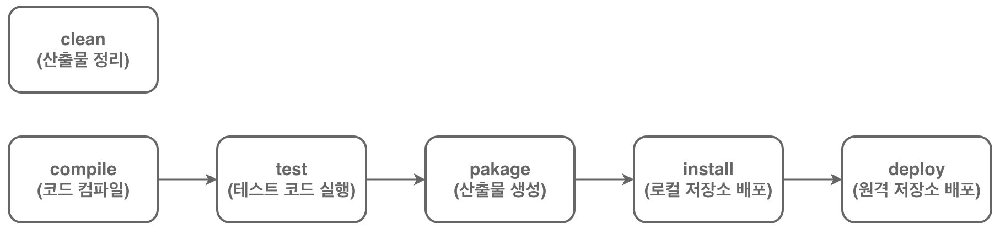

# 아파치 메이븐(Apache Maven)

- 메이븐(Maven)은 자바 기반의 프로젝트 관리 도구로 프로젝트의 빌드 과정을 자동화한다.
    - 빌드: 개발자가 만든 코드가 실행되기 위한 과정으로 컴파일, 패키징 등이 그 과정에 포함된다.

## POM(Project Object Model)

- `pom.xml` 설정 파일를 통해 프로젝트의 정보, 의존성(라이브러리), 빌드 설정(일련의 과정) 등을 **통합 관리**한다.

- 메이븐 프로젝트를 생성하면 프로젝트 최상위 디렉터리에 `pom.xml` 파일이 생성된다.(한 프로젝트에 하나 생성)

    ```xml
    <?xml version="1.0" encoding="UTF-8"?>
    <project xmlns="http://maven.apache.org/POM/4.0.0"
             xmlns:xsi="http://www.w3.org/2001/XMLSchema-instance"
             xsi:schemaLocation="http://maven.apache.org/POM/4.0.0 https://maven.apache.org/xsd/maven-4.0.0.xsd">
        <!-- 프로젝트 정보 설정 -->
        <!-- POM 버전 -->
        <modelVersion>4.0.0</modelVersion>

        <!-- 모든 프로젝트 중에서 같은 이름의 아티팩트를 식별하기 위해 사용. 주로 회사 도메인을 거꾸로 쓴다. -->
        <groupId>com.beyond</groupId>
        <!-- 보통 소문자로 작성하고, 이 아티팩트의 이름을 작성함. 다른 회사의 아티팩트와 이름은 겹칠 수 있다. 단, 같은 groupID 안에서는 유일해야 함. -->
        <artifactId>servlet</artifactId>
        <!-- 이 프로젝트의 버전 -->
        <version>1.0-SNAPSHOT</version>
        <!-- 프로젝트 이름 -->
        <name>01_Servlet</name>
        <!-- 패키징 유형. war는 Windows Artifact로, 확장자가 .war인 파일을 배포한다는 것 -->
        <packaging>war</packaging>
    
        <!-- 프로젝트에서 공통으로 사용할 값들을 정의 ****-->
        <properties>

            <!-- 인코딩, JDK 버전 등의 값을 설정한다. 태그의 값이 들어올 때 대신 쓰는 변수같은 것 -->
            <project.build.sourceEncoding>UTF-8</project.build.sourceEncoding>
            <maven.compiler.target>21</maven.compiler.target>
            <maven.compiler.source>21</maven.compiler.source>
            <junit.version>5.13.2</junit.version>
        </properties>
    
        <!-- 의존성 설정, 이 프로젝트가 의존하는 라이브러리들을 추가할 수 있다. -->
        <dependencies>
            <dependency>
                <groupId>jakarta.servlet</groupId>
                <artifactId>jakarta.servlet-api</artifactId>
                <version>6.1.0</version>
                <scope>provided</scope>
            </dependency>
    
            <dependency>
                <groupId>org.junit.jupiter</groupId>
                <artifactId>junit-jupiter-api</artifactId>
                <version>${junit.version}</version>
                <scope>test</scope>
            </dependency>
    
            <dependency>
                <groupId>org.junit.jupiter</groupId>
                <artifactId>junit-jupiter-engine</artifactId>
                <version>${junit.version}</version>
                <scope>test</scope>
            </dependency>
        </dependencies>
    
        <!-- 빌드 플러그인 설정 -->
        <build>
            <plugins>
                <plugin>
                    <groupId>org.apache.maven.plugins</groupId>
                    <artifactId>maven-war-plugin</artifactId>
                    <version>3.4.0</version>
                </plugin>
            </plugins>
        </build>
    </project>
    ```
    
- `pom.xml` 파일에서는 메이븐 프로젝트의 정보, 의존성, 빌드 설정 및 플러그인을 XML(Extended Markup Language) 형식으로 정의한다.
    - XML 파일에서는 태그를 이용해 문서를 표현한다. 기본적으로 `<여는 태그>`와 `</닫는 태그>` 사이에 문서 내용을 작성해서 정리함.

- 작성한 `pom.xml`과 원래 설정된 내용을 합쳐서 effective pom을 만들 수 있다. 
    - 기존 pom에 <build>부분에 매우 자세하게 적혀서 나온다.
    - 메이븐 프로젝트 전체 구조가 포함됨

## 메이븐 저장소

- 메이븐에서 저장소는 아티팩트(artifact)를 저장하는 공간이다.
    - 내가 만든 프로젝트의 산출물이 곧 아티팩트가 된다.
    - 배포되는 버전의 라이브러리라고 생각하면 편함

- 의존성 설정과 연관이 있다. `pom.xml`의 `dependency` 파트에 적혀 있음
    - `maven`, `gradle` 같은 빌드 툴에서는 원하는 아티팩트와, 그 아티팩트가 의존하는 다른 아티팩트까지 가져와 준다.

- 메이븐은 아티팩트 관리를 직접 하지 않아도 되게 편하게 해준다. 원래는 직접 의존성 체크하면서 관리해 줘야 함

- 직접 메이븐 레포지토리(`https://mvnrepository.com/`)에서 원하는 아티팩트를 검색해 다운로드 할 수도 있다.
    - `pom.xml`의 `<dependency>`에 복사한 메이븐 코드를 붙여넣고, 동기화하면 아티팩트를 사용할 수 있다.

### 원격 저장소

- 원격 저장소는 메이븐이 필요한 아티팩트(artifact)를 다운로드하는 저장소이다.

- 기본적으로 `Maven Central` 공개 저장소(`https://repo.maven.apache.org/maven2/`)에서 다운로드한다.

- 가끔 사내에서 직접 메이븐 저장소를 구축하고, 거기서 다운로드하는 경우도 있다.

### 로컬 저장소(`/.m2`)

- 로컬 저장소는 원격 저장소에서 다운로드한 아티팩트를 저장하는 공간이다.
    - 운영체제 상관없이, 다운로드한 아티팩트는 `~/.m2/repository`에 저장된다.

- 메이븐은 먼저 로컬 저장소에서 필요한 아티팩트를 확인하고, 없을 경우 원격 저장소에서 다운로드한다.


## 메이븐 빌드 생명 주기(Maven Build Life Cycle)



- 메이븐은 빌드 생명 주기(Lifecycle, 미리 정의된 빌드 순서)에 따라 동작한다.
    - 빌드 생명 주기는 여러 개의 단계(Phase)로 구성되며, 순차적으로 실행된다.

1. Clean Life Cycle
    - 이전 빌드의 산출물(target 폴더)을 전부 정리하는 주기
    - Phase가 딱 한 단계로 구성되어 있다. 

2. Default Life Cycle
    
    - 실제로는 단계가 이미지보다 좀 더 많다.
    
    - compile, 코드 컴파일 - test, 테스트 코드 실행 - package, 산출물 생성(.war, .jar로) - install, 로컬 저장소 배포 - deploy, 원격 저장소 배포
    
    - 생명 주기의 앞 단계가 완료된 후 다음 단계를 순차적으로 실행한다.
        - 컴파일, 패키징 등은 빌드의 한 단계라는 것
        - 만약 install 과정을 실행시키면 앞의 compile-test-package 작업이 먼저 실행되고, 끝나고 나서야 install 단계를 진행할 수 있다.


### 플러그인

```xml
<!-- effective POM -->
<plugin>
    <artifactId>maven-compiler-plugin</artifactId>
    <version>3.13.0</version>
    <executions>
        <execution>
        <id>default-compile</id>
        <phase>compile</phase>
        <goals>
            <goal>compile</goal>
        </goals>
        </execution>
        <execution>
        <id>default-testCompile</id>
        <phase>test-compile</phase>
        <goals>
            <goal>testCompile</goal>
        </goals>
        </execution>
    </executions>
</plugin>
```

- 메이븐의 실제 작업을 실행하는 실행 단위.
    - 생애 주기의 각 단계(Phase)는 직접 작업을 수행하지 않고, 연결된 플러그인의 Goal을 실행한다.
    - 생명 주기, 단계는 그냥 개념적으로만 존재하는 것이고, 실제로 실행되는 것은 플러그인이다.
    - 플러그인은 항상 하나 이상의 Goal을 가진다. 여러 개 가질 수도 있음.

- compile 빌드를 실행할 경우, 연결된 `maven-compiler-plugin`을 실행해서 작동시키는 것.
    - 만약 다른 compiler를 쓰고 싶다면, 다른 플러그인을 가져와서 적용하면 된다.

- 나중에 spring boot 쓰면 자동으로 플러그인 연결부터 빌드까지 해준다.