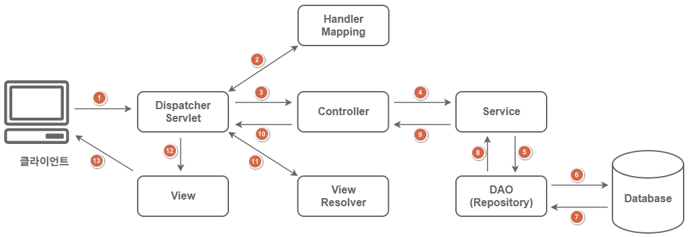

# 스프링 프레임워크(Spring Framework)

- 자바 애플리케이션 개발을 위한 오픈 소스 프레임워크로 일반적으로 스프링(Spring)이라고 부른다.
- 엔터프라이즈급 애플리케이션 개발을 위한 다양한 기능을 제공하며, 대한민국 전자정부 표준프레임워크의 기반 기술로 사용되고 있다.
- 스프링은 `DI(Dependency Injection)`와 `AOP(Aspect Oriented Programming)`를 기반으로 객체의 결합도를 낮추고, `POJO(Plain Old Java Object)` 기반 개발을 통해 유지 보수와 테스트가 용이한 구조를 제공한다.

## 프레임워크(Framework)

- 애플리케이션의 기본 구조와 공통 기능이 **미리 구현**되어 있으며, 개발자는 정해진 구조 안에서 기능을 구현할 수 있도록 지원한다.
- 소프트웨어를 구현하는 개발 시간을 줄이고, 반복되는 부분을 최소화할 수 있도록 설계되어 있다.
- 일정 수준 이상의 품질을 보장하는 애플리케이션을 개발할 수 있는 환경을 제공한다.

### 프레임워크(Framework)의 특징

1. 장점: 생산성과 품질 향상

    - 공통 기능이 미리 구현되어 있어 개발 시간을 단축할 수 있다.
    - 검증된 구조와 설계 패턴을 기반으로 하기 때문에 일정 수준 이상의 품질을 확보할 수 있다.
    - 추상화가 잘 되어 있기 때문에 코드의 일관성이 유지되어 유지 보수가 용이하다.

2. 단점: 구조적 제약과 학습 난이도

    - 정해진 구조와 규칙에 따라 개발해야 한다.
    - 동작 원리를 이해하지 못하면 사용이 어렵기 때문에 초기 학습 난이도가 비교적 높은 편이다.
    - 또한 동작 원리를 이해하지 못하면 문제 발생 시 원인 분석이 어려울 수 있다.
    - 사용되지 않는 기능에 대해서도 라이브러리가 포함될 수 있다.

### 주요 개념

1. DI (Dependency Injection, 의존성 주입)

    - 객체 간의 의존 관계를 개발자가 직접 생성하지 않고, 설정 파일(XML, Java Config)이나 어노테이션 설정을 기반으로 애플리케이션 컨텍스트가 객체를 주입한다.
    - 이를 통해 의존 관계에 있는 객체들 간의 결합도를 낮출 수 있다.

2. AOP (Aspect Oriented Programming, 관점 지향 프로그래밍)

    - 트랜잭션, 로깅, 보안과 같은 공통 관심사를 핵심 비즈니스 로직과 분리하여 모듈화한다.
    - 이를 통해 공통 관심사와 비즈니스 로직 간의 결합도를 낮출 수 있다.

3. POJO (Plain Old Java Object)

    - 특정 프레임워크나 기술에 종속되지 않는 순수 자바 객체 기반으로 개발하는 방식을 의미한다.
    - 별도의 상속이나 구현을 강제하지 않으며, 일반적인 자바 객체처럼 사용할 수 있다.
    - 이를 통해 프레임워크에 대한 강한 의존 없이 개발 및 테스트가 용이하고, 유지보수가 쉬운 구조를 만들 수 있다.

## 스프링 MVC

- MVC 패턴은 모델(Model), 뷰(View), 컨트롤러(Controller)로 역할을 분리하여 애플리케이션의 구조를 명확하게 하고 유지보수와 확장이 용이한 장점이 있다.
- 스프링 프레임워크는 웹 애플리케이션을 개발할 때 MVC(Model-View-Controller) 패턴을 기반으로 애플리케이션을 구성할 수 있도록 지원한다.
- 또한 모델(Model), 뷰(View), 컨트롤러(Controller) 간의 의존 관계를 스프링 컨테이너가 관리하여 유연한 웹 애플리케이션을 개발할 수 있다.
    
    | 어노테이션 | 설명 |
    | --- | --- |
    | @Controller | 웹 애플리케이션에서 웹 요청과 응답을 처리하는 객체(Bean)를 생성한다. |
    | @Service | 웹 애플리케이션에서 비즈니스 로직을 처리하는 객체(Bean)를 생성한다. |
    | @Repository | 웹 애플리케이션에서 영속성(파일, 데이터베이스) 처리를 위한 객체(Bean)를 생성한다. |

### 스프링 MVC 요청 처리 과정

- 디스패처 서블릿(`DispatcherServlet`)은 사용자의 요청을 받는 프론트 컨트롤러 서블릿이다.
    - 모든 요청은 디스패쳐 서블릿을 통해서 전달됨
    - 정적 요청들은 안통하게 따로 설정

- 매핑 핸들러(HandlerMapping)은 요청 URL을 바탕으로 적절한 컨트롤러를 선택하는 역할을 한다.

- 컨트롤러(Controller)는 요청을 처리하기 위한 객체(Bean)이다.

- 서비스(Service)는 비즈니스 로직을 처리하기 위한 객체(Bean)이다.

- 저장소(Repository)는 데이터 처리를 위한 객체(Bean)이다.

- 뷰 리졸버(ViewResolver)는 디스패처 서블릿에서 전달해 주는 뷰(View)의 이름과 실제로 구현된 뷰를 매핑해준다.

- 뷰(View)는 요청 처리 결과를 렌더링(시각화) 한다.
