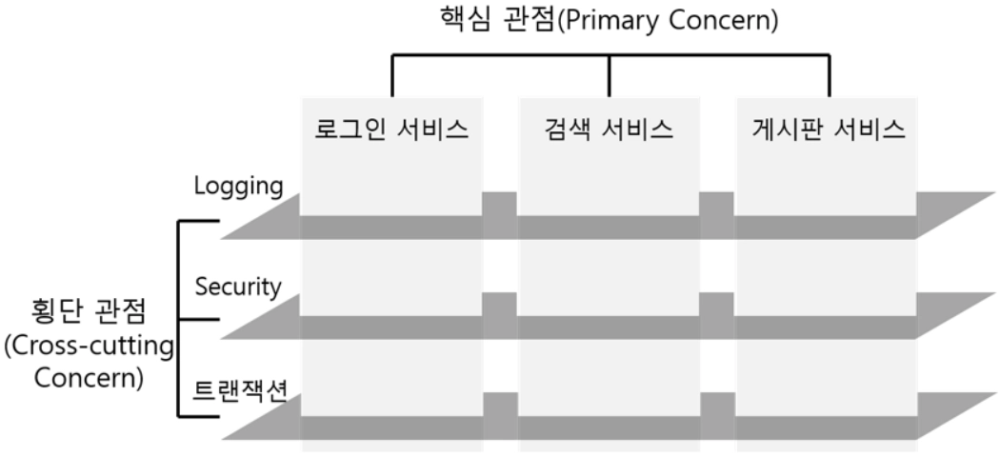

# AOP (Aspect Oriented Programming, 관점 지향 프로그래밍)

- 트랜잭션, 로깅, 보안과 같은 공통 관심사를 핵심 비즈니스 로직과 분리하여 모듈화한다.
- 이를 통해 공통 관심사와 비즈니스 로직 간의 결합도를 낮출 수 있다.

- 애플리케이션의 여러 부분에 걸쳐 있는 기능을 횡단 관심사(Cross-cutting concerns)라고 한다.
- AOP는 이러한 횡단 관심사를 분리하고 분리한 기능을 어디에 어떻게 적용할지 선언적으로 정의할 수 있다.
- AOP의 목적은 횡단 관심사와 이에 영향받는 객체 간 결합도를 낮추는데 있다.



## AOP 용어

- 애스펙트(Aspect)는 횡단 관심사를 분리하여 작성한 클래스이다. (어드바이스 + 포인트컷)
- 어드바이스(Advice)는 애스펙트가 해야 할 작업과 언제 그 작업을 수행해야 하는지 정의하는 것을 말한다.
- 조인포인트(JoinPoint)는 어드바이스가 적용될 수 있는 모든 곳을 의미한다. (메소드 호출 지점, 예외 발생 지점, 필드 등)
- 포인트컷(PointCut)은 여러 조인포인트 중에 실제 어드바이스가 적용될 조인 포인트를 정의하는 것을 말한다.
- 대상 객체(Target Object)는 애스펙트가 적용될 객체를 말한다.
- 위빙(Weaving)은 대상 객체에 애스펙트를 적용하는 것을 말한다.
    
    
    | 위빙 시점 | 설명 |
    | --- | --- |
    | 컴파일 시 위빙 | 대상 클래스가 컴파일될 때 위빙된다. |
    | 클래스 로딩 시 위빙 | 대상 클래스가 JVM에 로드될 때 위빙된다. |
    | 런타임 시 위빙 | 애플리케이션 실행 중에 위빙된다. (스프링) |

## Spring AOP

1. 메소드 조인 포인트만 지원한다.

    - 대상 객체의 메소드가 호출되는 런타임 시점에만 어드바이스을 적용할 수 있다.
    - AspectJ 같은 고급 AOP 프레임워크를 사용하면 객체의 생성, 필드 값의 조회와 조작, static 메소드 호출 및 초기화 등의 다양한 작업에 어드바이스를 적용할 수 있다.

2. 프록시(Proxy) 기반의 AOP를 지원한다.

    - 프록시(Proxy)는 대상 객체에 어드바이스가 적용된 후 생성되는 객체로 대상 객체에 직접 접근을 제한하는 역할을 하는 객체이다.
    - Spring AOP는 대상 객체에 대한 프록시를 만들어 제공하며, 대상 객체를 감싸는 프록시는 런타임 시에 생성된다.
    - 프록시는 대상 객체의 메소드 호출을 가로채어 어드바이스를 수행하고 대상 객체의 메소드를 호출하거나 대상 객체의 메소드를 호출 후 어드바이스를 수행한다.


## Spring AOP 구현 방법

- 스프링은 AspectJ의 어노테이션을 사용하여 애스펙트를 생성할 수 있다.
    - 이 떄 어드바이스에서 해야 하는 작업은 메소드로 정의해서 넣어준다.
    - 이 어드바이스를 언제 실행할지가 어노테이션(`@Before`, `@After`)으로 작성되고, 포인트컷 지정자를 통해 조인포인트를 좁힐 수 있다.
    
    ```java
    // Aspect 클래스는 bean이면서 aspect가 된다.
    @Aspect
    @Component
    public class 클래스명 {
        @Before("포인트컷 지정자")
        public void before() {
            // 메소드 실행 전에 적용되는 어드바이스를 정의
        }
        
        @After("포인트컷 지정자")
        public void after() {
            // 결과에 상관없이 메소드 실행 후에 적용될 어드바이스를 정의
        }
        
        @AfterReturning("포인트컷 지정자")
        public void success() {
            // 메소드가 정상적으로 실행된 후에 적용되는 어드바이스를 정의
        }
        
        @AfterThrowing("포인트컷 지정자")
        public void fail() {
            // 메소드가 예외를 발생시킬 때 적용되는 어드바이스를 정의
        }
        
        @Around("포인트컷 지정자")
        public String around(ProceedingJoinPoint jp) {
            // 메소드 호출 이전, 이후, 예외 발생 등 모든 시점에 적용 가능한 어드바이스를 정의
        }
    }
    ```
    - `@After`는 대상 메소드의 수행 결과가 제대로 리턴이 되던, 예외가 발생하던 어드바이스가 실행된다.
        - `@AfterReturning`, `@AfterThrowing` 으로 케이스를 나눠 주어야 한다.

    - `@Around`는 @Before, @After, @AfterReturning, @AfterThrowing의 기능을 다 합친 기능
        ```java
        @Around("execution(* com.beyond.aop.character.Character.quest(..))")
        public String around(ProceedingJoinPoint jp) {    
            try {
                // @Before
                result = (String) jp.proceed();
                // @AfterReturning
            } catch (Throwable e) {
                // @AfterThrowing
            }
            return result;
        }
        ```
        - 다양한 기능을 하나의 어드바이스에서 전부 수행하게 할 수 있다.
            - `.proceed()`에서 대상 메소드가 실행된다.
            - try 구문 안 `.proceed()` 이전은 @Before, 이후는 @AfterReturning, catch 내부는 @AfterThrowing이 된다.

        - 어드바이스 내에 `jp.proceed()` 메소드를 넣으면 proceed() 기준으로 대상 메소드가 실행되고, 리턴값도 저장된다.
            - 타겟 객체의 메소드에 매개값을 변환해서 다시 전달할 수도 있다.
            - 기존 대상 메소드의 파라미터 순서에 맞게 `new Object[] {파라미터, ..}`(`Object` 배열) 형식으로 전달함


        - `jp.getArge()`는 대상 메소드의 매개값들을 `Object` 배열에 담아서 반환한다.
            - 굳이 포인트컷 지정자에 매개값을 넣고 returning, argNames 작성하면서 귀찮게 작성할 필요가 없어진다. 

- AsepctJ 어노테이션을 적용을 위해서는 설정 파일에 아래와 같이 프록시 설정을 해야한다.
    
    ```xml
    <!-- XML 설정 -->
    <beans>
        <aop:aspectj-autoproxy/>
    </beans>
    ```
    
    ```java
    // Java 설정
    @Configuration
    @EnableAspectJAutoProxy
    public class RootConfig {
    }
    ```

### 포인트컷 지정자

스프링 AOP에서는, AspectJ의 포인트컷 표현식(어떤 메소드를 실행시킬지)을 이용해 포인트컷 지정자를 표현한다.

```java
@Before("execution([접근제한자] 리턴타입 클래스.메소드([파라미터, ...])) && args(매개값)")
```
- `execution`은 특정 메소드의 (실행 전/실행 후/...) 시점에 어드바이스를 실행시킬지를 알려주는 지정자이다. 
    - 접근제한자는 생략 가능
    - `*`: 모든 타입을 의미
        - 모든 리턴타입에 대해 어드바이스를 실행하고 싶다면 리턴타입 자리에 `*`을 표현하는 식
        - 특정 패키지의 모든 클래스에 대해 실행하고 싶을 때 패키지 아래에 `*`을 주면 모든 클래스를 선언
    - `..`을 주면 0개 이상을 의미함. 주로 파라미터들에 대해 작성한다
    - `args(매개값)`: 대상 메소드에 전달되는 매개값을 어드바이스에 전달하기 위한 표현식(`@Around`부터는 사용 안함)

- `execution` 뒤에 `&&`, `||`을 이용해 다른 조건 하에 어드바이스가 실행되도록 할 수 있다.
    - `bean(빈ID)`: 특정 빈에만 어드바이스를 실행하고 싶을 때 이용한다.
    - `@annotation(어노테이션 이름)`: 특정 어노테이션이 있을 때만 어드바이스를 붙이도록 하고 싶을 때


1. `@PointCut` 어노테이션을 이용해 포인트컷 지정자도 변수처럼 이용할 수 있다.
    ```java
    @Pointcut("execution(* com.beyond.aop.character.Character.quest(..))")
    public void questPointCut() {}

    @Before("questPointCut()")
    public void beforeQuest() { ... }
    ```

2. `args`를 이용해 대상 메소드에서 주어진 매개변수를 어드바이스에서도 사용할 수 있다.
    ```java
    @Pointcut("execution(* com.beyond.aop.character.Character.quest(..)) && args(questName)")
    public void questPointCut(String questName) {}

    @Before(value = "questPointCut(questName)", argNames = "questName")
    public void beforeQuest(String questName) { ... }
    ```
    
3. 대상 메소드가 어떤 값을 반환할경우, 이 결과값을 `@AfterReturning` 어드바이스에서 이용 가능하다.
    ```java
    @AfterReturning(
            value = "questPointCut(questName)",
            returning = "result",  // 대상 메소드가 return한 값
            argNames = "questName, result")
    public void success(String questName, String result) { ... }
    ```

4. 대상 메소드가 에러를 던질 경우에도 이 값을 객체에 넣어서 이용 가능하다.
    ```java
    @AfterThrowing(
            value = "questPointCut(questName)",
            throwing = "exception",  // 대상 메소드가 throw한 예외
            argNames = "questName, exception")
    public void fail(String questName, Exception exception) { ... }
    ```

## 어노테이션

- JDK 1.5부터 추가된 기능으로, 코드에 대한 추가적인 정보를 제공하는 메타데이터
    - 비즈니스 로직에 영향을 주지는 않지만, 컴파일 과정에서 유효성 체크, 코드 컴파일 방식 등을 알려주는 정보를 제공
    - 클래스, 메소드, 필드, 매개변수 등에 추가할 수 있다.
    - 프레임워크에서도 어노테이션을 이용해 자기 작업을 실행하는데 활용한다.


- 어노테이션은 `@`가 붙은 인터페이스 형태로 만들어진다. 
    ```java
    @Target({METHOD, FIELD})
    @Retention(RUNTIME)
    public @interface Nologging { ... }
    ```
    - `@Target({METHOD, FIELD})`
        - 어디에 이 어노테이션을 붙일 지 선언하는 역할 - 메소드(METHOD)와 필드(FIELD)에만 작성할 수 있게 제한함
    - `@Retention(RUNTIME)`
        - 어노테이션의 유효범위를 지정
            - SOURCE: 소스코드에서만 유효한 범위 - @Data, @Override
            - CLASS: 클래스를 참조할 때까지 유효
            - RUNTIME: 코드가 실행 중일 때에도 유지, JVM에 의해 참조 가능 - @AutoWired, @Component
    - `@Inherited` 
        - 부모 클래스에서 어노테이션 선언 시 자식 클래스에도 상속됨

- 어노테이션에 직접 속성을 만들 수 있다.

    ```java
    // 어노테이션
    @Target(METHOD)
    @Retention(RUNTIME)
    public @interface Repeat {
        String value() default "기본값";
        int count() default 0;
    }
    ```
    ```java
    // 빈
    // @Repeat("반복 횟수 지정")
    @Repeat(value="반복 횟수 지정", count=10)
    public String do() { ... }
    ```
    ```java
    @Around("@annotation(com.beyond.aop.annotation.Repeat)")
    public String repeatAdvice(ProceedingJoinPoint jp) {
        String result = "";
        MethodSignature signature = (MethodSignature) jp.getSignature();
        Repeat repeat = signature.getMethod().getAnnotation(Repeat.class);

        System.out.println(repeat.value());
        System.out.println(repeat.count());
        
        ...
    }
    ```

    - 어노테이션에서 속성을 부여할 때는 추상 메소드처럼 작성된다.
    - 속성을 부여할 수 있고, 그 속성값에 기본값도 줄 수 있다.
        - 속성명이 value이면 속성명을 생략할 수 있다.
    - 이 속성을 매우 복잡한 과정을 이용해 사용할 수 있다.
