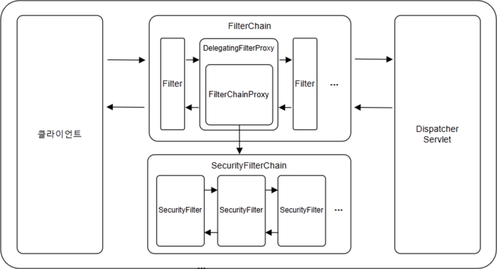
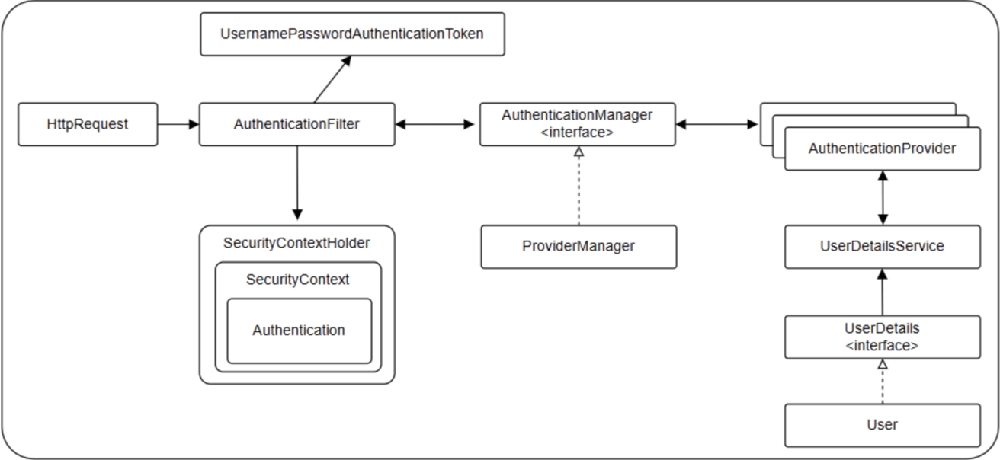

# 스프링 시큐리티(Spring Security)

## 1. 스프링 시큐리티(Spring Security)

- 스프링 시큐리티는 애플리케이션의 `인증(Authentication)`과 `인가(Authorization)` 등의 보안 기능을 제공하는 스프링 하위 프로젝트이다.
- `인증(Authentication)`은 사용자가 누구인지 확인하는 과정으로 대표적인 예로 로그인이 있다.
- `인가(Authorization)`는 `인증(Authentication)`된 사용자가 특정 리소스에 접근할 때 해당 리소스에 접근할 권한이 있는지 확인하는 과정이다.
- `접근 주체(Principal)`는 애플리케이션 기능을 사용하는 주체를 의미한다.
- 스프링 시큐리티를 사용하는 애플리케이션은 인증 과정을 통해 접근 주체가 신뢰할 수 있는지 확인하고, 인가 과정을 통해 접근 주체에게 부여된 권한을 확인하는 과정을 거친다.

## 2. 스프링 시큐리티 동작 구조

- 스프링 시큐리티는 `서블릿 필터(Servlet Filter)를` 기반으로 동작하며 `DispatcherServlet` 앞에 필터가 배치되어 있다.
- 스프링 시큐리티는 사용하고자 하는 필터 체인을 동작시키기 위해 `DelegatingFilterProxy`를 사용한다.
- `DelegatingFilterProxy`는 서블릿 필터를 구현하고 있으며, 역할을 위임할 `FilterChainProxy`를 내부에 가지고 있다.
    
        

## 3. 스프링 시큐리티 인증 처리 과정

- 별도의 설정이 없다면 스프링 시큐리티에서는 `UsernamePasswordAuthenticationFilter`를 통해 인증을 처리한다.
    
        

## 4. JWT(JSON Web Token)

### 4.1. JWT(JSON Web Token)

- `JWT(Json Web Token)`는 웹에서 사용되는 JSON 형식의 토큰에 대한 표준이다.
- 사용자의 인증(authentication)과 인가(authorization) 정보를 서버와 클라이언트 간에 안전하게 주고받기 위해서 사용된다.

### 4.2. JWT의 구조

- JWT는 `헤더(Header)`, `내용(Payload)`, `서명(Signature)`으로 이루어져 있으며 `.`으로 구분한다.
    
    ```
    xxxxx(헤더).yyyyy(내용).zzzzz(서명)
    ```
    
- `헤더(Header)`에는 토큰의 타입과 해싱 알고리즘을 지정하는 정보를 담는다.
    
    ```json
    {
      "alg": "HS256",
      "typ": "JWT"
    }
    ```
    
- `내용(Payload)`에는 토큰에 담는 정보를 포함한다.
- `내용(Payload)`에 포함된 속성들을 `클레임(Claim)`이라 하며 등록된 클레임(Registered Claim), 공개 클레임(Public Claim), 비공개 클레임(Private Claim) 세 가지로 분류된다.
    
    ```json
    {
      "sub": "1234567890",
      "exp": 1506239022,
      "iat": 1516239022,
      "username": "Gil-Dong Hong",
      "email": "hong@gmail.com"
    }
    ```
    
- 완성된 `헤더(Header)`와 `내용(Payload)`은 `Base64Url` 방식으로 인코딩되어 사용된다.
- `서명(Signature)`은 인코딩된 `헤더(Header)`와 `내용(Payload)`을 결합한 값을 헤더에 정의된 알고리즘과 비밀키를 이용해 생성한다.
    
    ```
    HMACSHA256(
      Base64Url(Header) + "." + Base64Url(Payload),
      secretKey
    )
    ```
    
- 완성된 `서명(Signature)`은 `Base64Url` 방식으로 인코딩되어 사용된다.
    
    ```html
    Base64Url(Header) + "." + Base64Url(Payload) + "." + Base64Url(Signature)
    ```
    

### 4.3. JWT의 인증 과정

- 클라이언트에서 사용자의 ID와 비밀번호를 사용해 서버에 로그인 요청을 한다.
- 서버는 사용자의 로그인 요청이 유효하다고 판단하면 사용자의 정보를 포함한 JWT를 생성해 클라이언트에게 응답한다.
- 클라이언트는 응답받은 JWT를 로컬 저장소(LocalStorage)나 쿠키에 저장하고 인증이 필요한 요청의 경우 HTTP 헤더에 JWT를 포함해 서버로 요청한다.
    
    ```
    Authorization: Bearer <JWT>
    ```
    
- 서버는 인증이 필요한 클라이언트 요청에 대해 JWT의 서명을 확인해 무결성과 유효성을 검증하고 검증에 성공하면 요청한 리소스를 클라이언트에게 제공한다.